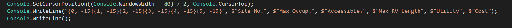

# Welcome to the Park Reservation System!


Our park reservation system was designed to view and create campsite reservations amongst 3 major park systems. Site reservations had to 
manuever around existing reservations as well as handle the seasonal hours of the various campgrounds throughout each park. To accomplish this we created Data Access Layers to interact with our database through SQL Server, constructing queries to validate and insert data while guarding against SQL injection as well as return sorted data. 

Our parameters/requirements were the following: 
1. View the available parks in the system, sorted alphabetically.
2. Ability to select parks and view all campgrounds and their information for the chosen park.
3. Select a campground and search for date availability in order to make reservations. 
    * BONUS REQUIREMENT - return only campsites available by season.
4. Ability to book available campsite and receive confirmation id.
5. BONUS Search across an entire park for campsite availability and make a reservation.

## Highlights 


We needed to use a dictionary to translate the integer values from our database that represented the months into a presentable string form for our users to view. 


This is the project on which DateTime ceased to be a scary word, when I realized how developer friendly Microsoft made it. Tons of available methods that really make verification of various dates extremely easy to handle. 


A neat way to structure the Console output of data. This makes .PadLeft and .PadRight unecessary most of the time. 

```
private static void PrintMenuDoubleSpaced(string[] menu)
{
    int longest = menu.Max(x => x.Length);

    foreach (string s in menu)
    {
        Console.SetCursorPosition((Console.WindowWidth - longest) / 2, Console.CursorTop);

        Console.WriteLine(s);
        Console.WriteLine();
    }
}
```
No reason to fill your code with a bunch of print statements, we separated out our writelines while simultaneously formatting the text how we wanted it to be displayed. This is an implementation of the Do Not Repeat Yourself principle of writing clean code. 

```
private static void PrintWelcome()
{

    Console.BackgroundColor = backgroundColorForText;
    Console.ForegroundColor = foregroundColorForText;

    List<string> welcome = new List<string>();

    welcome.Add(":::       ::: :::::::::: :::        ::::::::   ::::::::  ::::    ::::  ::::::::::");
    welcome.Add(":+:       :+: :+:        :+:       :+:    :+: :+:    :+: +:+:+: :+:+:+ :+:       ");
    welcome.Add("+:+ +:+ +:+ + :+         +:+       +:+        +:+    +:+ +:+ :++:  +:+ +:+       ");
    welcome.Add("+#+  +:+  +#+ +#++:++#   +#+       +#+        +#+    +:+ +#+  +:+  +#+ +#++:++#  ");
    welcome.Add("+#+ +#+#+ +#+ +#+        +#+       +#+        +#+    +#+ +#+       +#+ +#+       ");
    welcome.Add(" #+#+# #+#+#  #+#        #+#       #+#    #+# #+#    #+# #+#       #+# #+#       ");
    welcome.Add("  ###   ###   ########## ########## ########   ########  ###       ### ##########");

    PrintMenuSingleSpaced(welcome.ToArray());
    Console.BackgroundColor = backgroundColor;
    Console.ForegroundColor = foregroundColor;
}
```
No console line application would be complete with a ridiculous piece of ASCII art. It's a little hard to read here but this is the "welcome" line from our first "View"


This SQL Query was known as the big one. It took me way longer to figure out than I should probably admit and I thought I had it solved several times before finding some edge case that it didn't work for. But it all worked out in the end and that moment of discovery when I finally got it working was well worth it!


This monster was fun as well. This is the bonus query that let's you search by park. The interesting thing about this query is that the open-to and open-from months were integers but had to be compared against DateTimes. Grabbing the rightmost digits from our DateTimes we were able to make a simple comparison of integers!  

